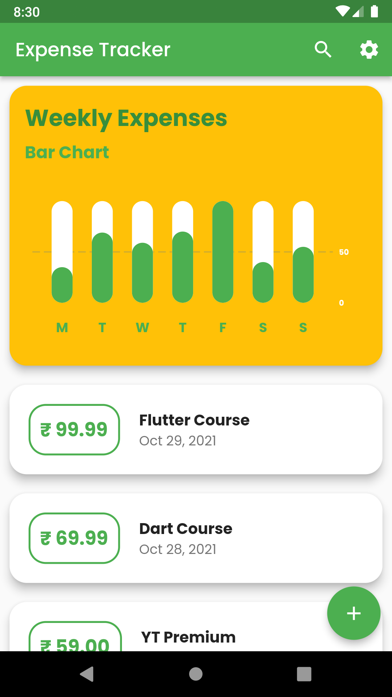
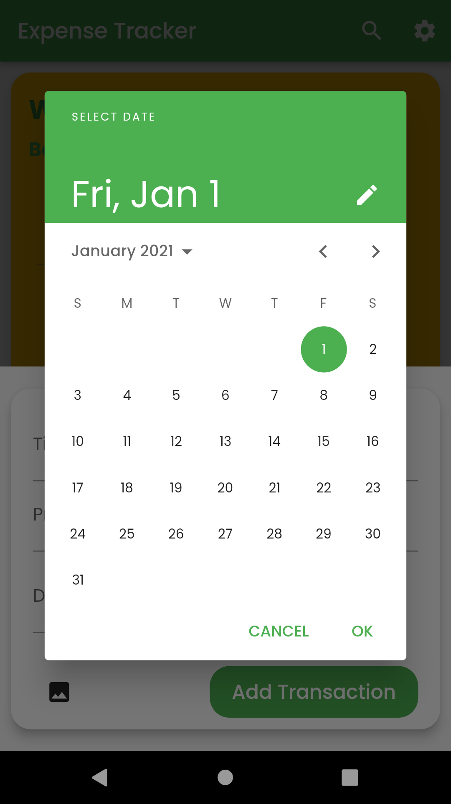
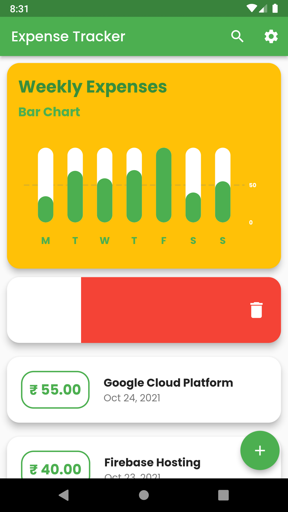

# Expense-tracker App using Flutter

Expense Manager can track your expenses and even show you last week's per day expenses in a simple chart. Expenses are stored locally in the device using SQLite Database. 

## Features
 
- Last week transactions summary.
- Simple and intuitive UI.
- Beautiful Material Design.
- Uses SQLite for storing data locally in your device hence great privacy.
- Works offline.

## Screenshots

## Getting started with Flutter

This project is a starting point for a Flutter application.
A few resources to get you started if this is your first Flutter project : 

- [Lab: Write your first Flutter app](https://flutter.dev/docs/get-started/codelab)
- [Cookbook: Useful Flutter samples](https://flutter.dev/docs/cookbook)

For help getting started with Flutter, view our
[online documentation](https://flutter.dev/docs), which offers tutorials,
samples, guidance on mobile development, and a full API reference.
